# Projeto filmes

# Link Figma: https://www.figma.com/design/mlWfBOUTGxjoEbkNSplA9w/Untitled?m=auto&t=RELPzDugtSKyWnLS-6

# Página Darinha

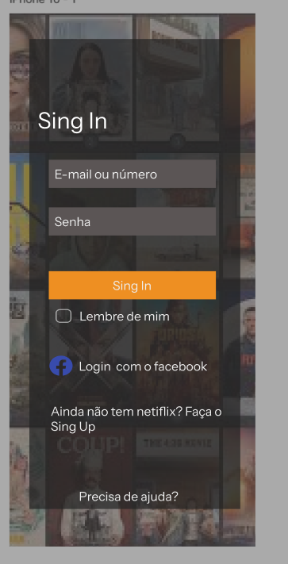;

  A página acima mostra como foi feito a ideia do site, o prototipo foi feito pelo site do figma! Me inspirei na netiflix para fazer a tela de login. 

  
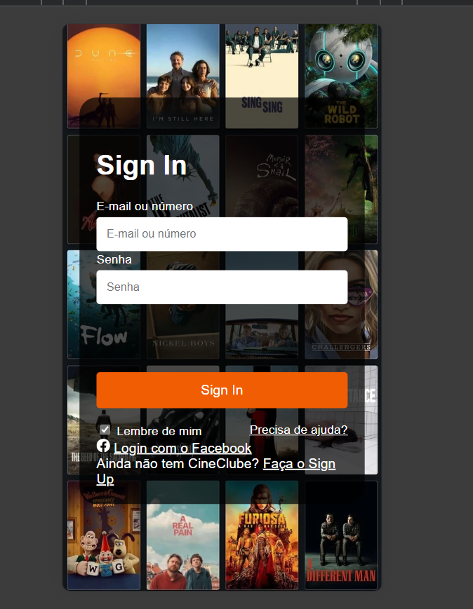

 A imagem acima mostra a tela de mobile pronta, bem parecida com o prototipo inicial. Os requisitos da tela de Mobile e de front são os mesmos. Então decidi apenas explicar o que cada um funciona apenas na tela de front. 

A imagem acima mostra o projeto de front finalizado. Com lugar para colocar e-mail ou número de telefone, sua senha, você também pode fazer login com o facebook caso não seja cadastrado. Como me inspirei na netiflix, você clicando no "precisa de ajuda", sera direcionado para a central de ajuda da Netiflix. Assim como para fazer o cadastro (caso não tenha), tambem sera direcionado para a Netiflix.

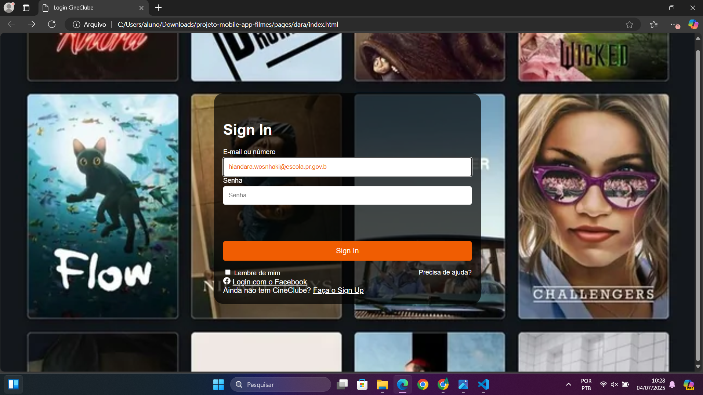;

A imagem acima mostra que é possivel você digitar seu e-mail ou número de telefone, escolhi a cor laranja pois queriamos algo diferentes dos sites de filmes. 

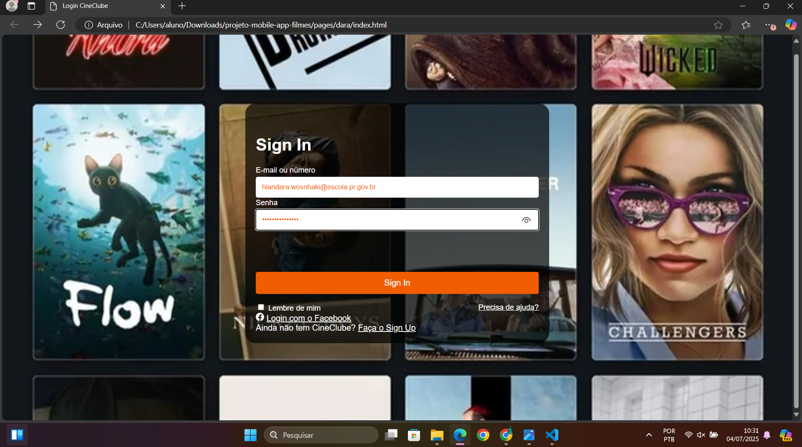;

A imagem acima mostra como coloca a senha, e é possível esconder sua senha mostrada como na imagem abaixo. Escolhi fazer assim, pois é uma segurança a mais caso a pessoa vá logar com outras olhando. 

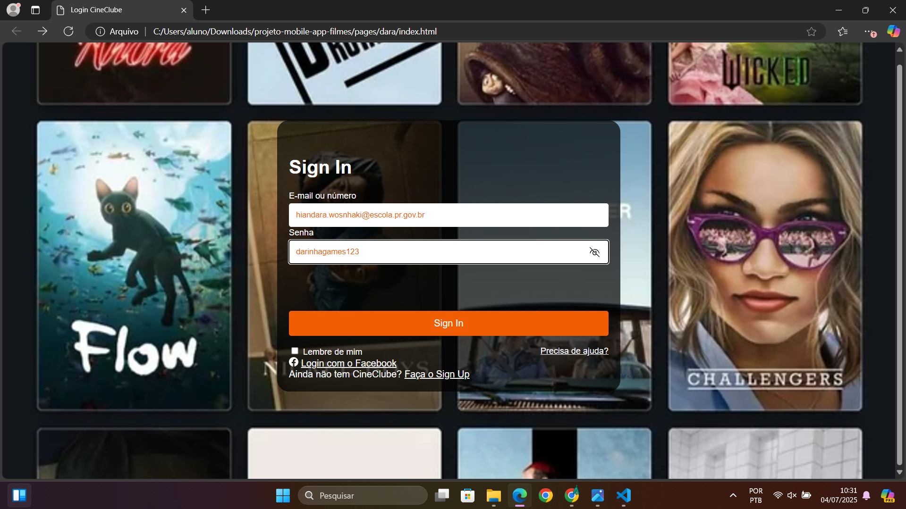

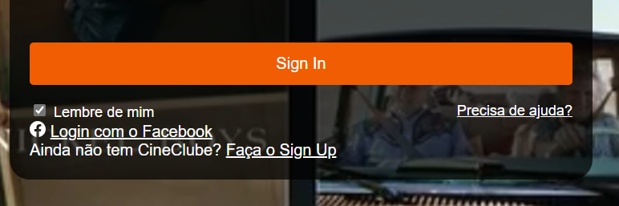;

A imagem acima mostra a checbox, que ao apertar, é salva suas informaçoes, e não é necessario logar de volta. Além de mostar

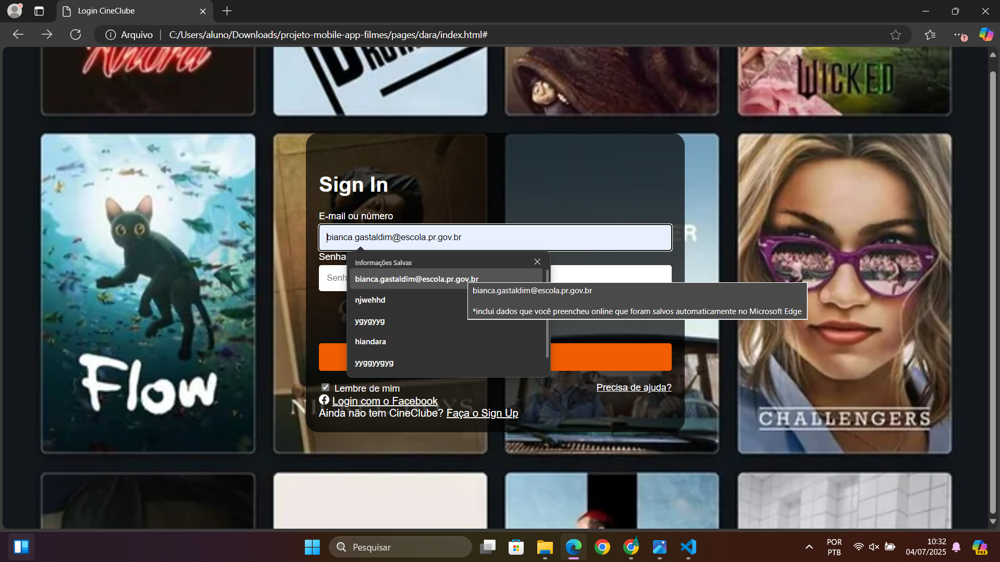;

# pag grazzy

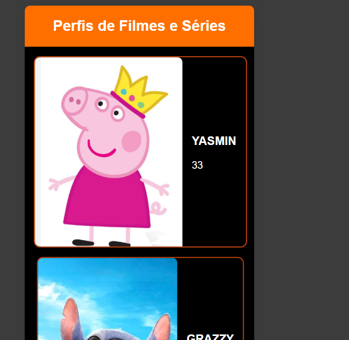 
a imagem mostra a pagina de seleção de perfil onde se inicia a experiência do usuario.

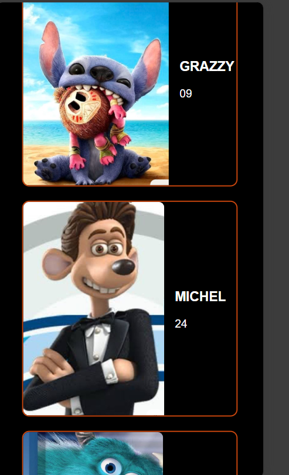 esta imagem tambem apresenta um card de seleção de perfil, a pagina e basicamente isso somente.

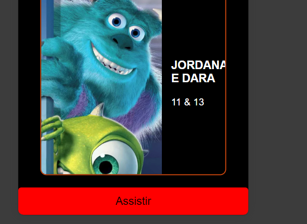
A ultima imagem mostra o botão que liga minha pag a da jordana direciona diretamente para a pag dela

# página jor

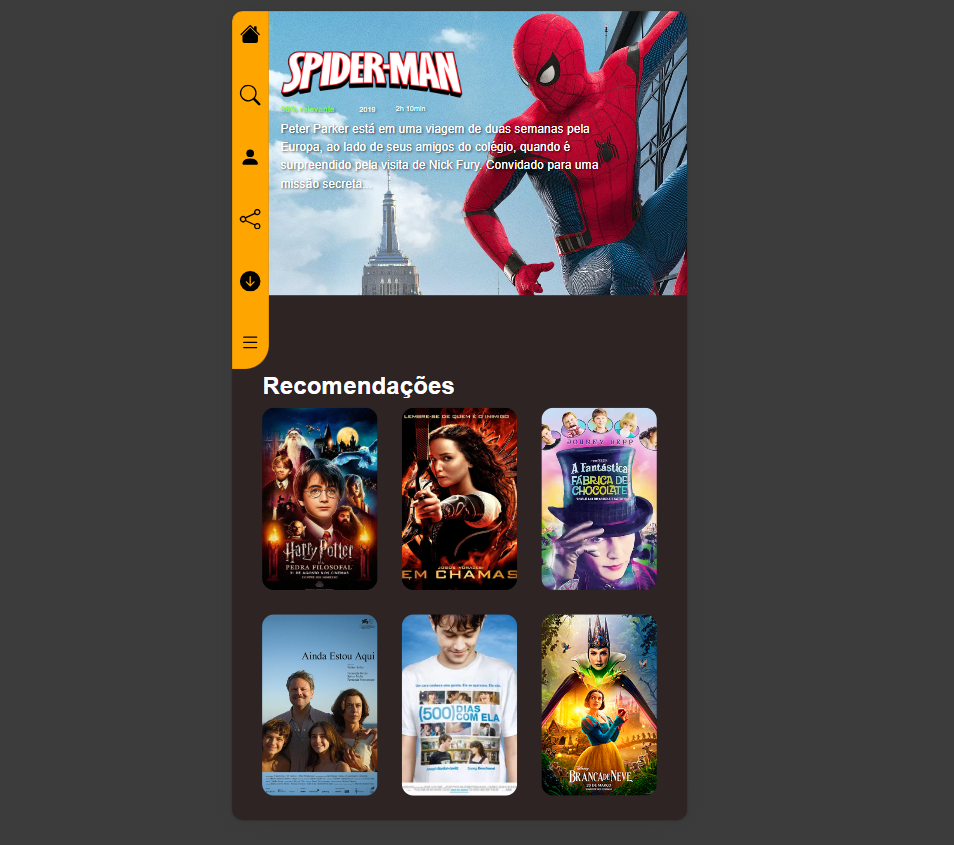

A imagem mostra a visão geral da página para celulares, tendo o filme do Homem-Aranha em destaque e abaixo mais 6 recomendações de filmes. No canto da página podemos ver a navebar que direciona para as outras páginas do site, sendo o símbolo de lupa direcionando para a página do sanduíche, o símbolo de perfil para a página da grazi, o compartilhar e dowload para a página do michel e o menu para a página da yasmin.

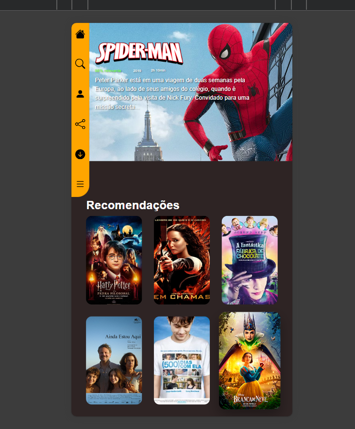

A imagem começa a mostrar as funcionalidades da tela, mostrando o efeito de zoom na imagem dos filmes abaixo de "recomendações" quando você clica em cima.

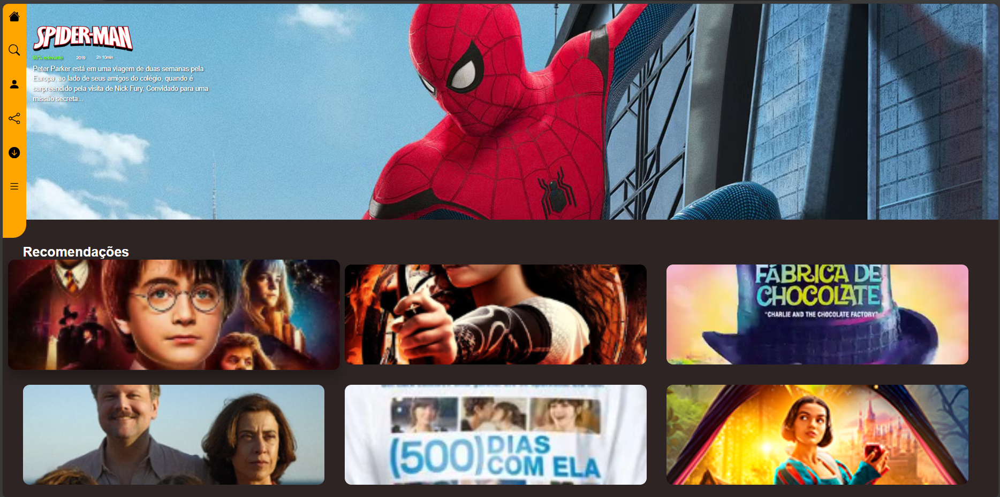

A imagem mostra a tela em formato para computadores, tendo alteração no tamanho da navebar e no tamanho das fotos dos filmes, diferenciando o tamanho com que eles se distribuem para que continue proporcional. Diferente da tela de celulares, para ter o efeito de zoom não é preciso clicar no filme, o efeito acontece apenas com o mouse passando em cima. 

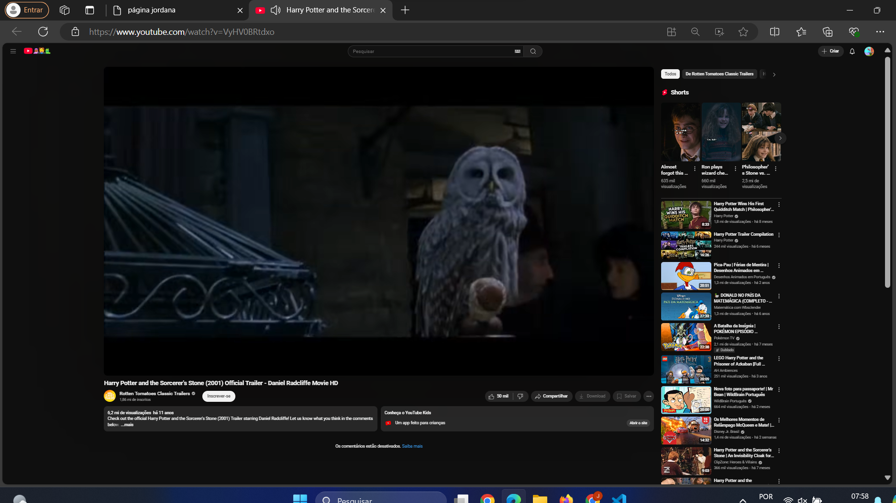 

A imagem mostra o que a API faz, nesse caso, ao clicar em algum dos filmes abaixo de "recomendações" você é redirecionado para o trailer do filme no YouTube, não usa APIs específicas do vs code mas usa funcionalidades típicas da Web API (como document.addEventListener, querySelector, etc.) 

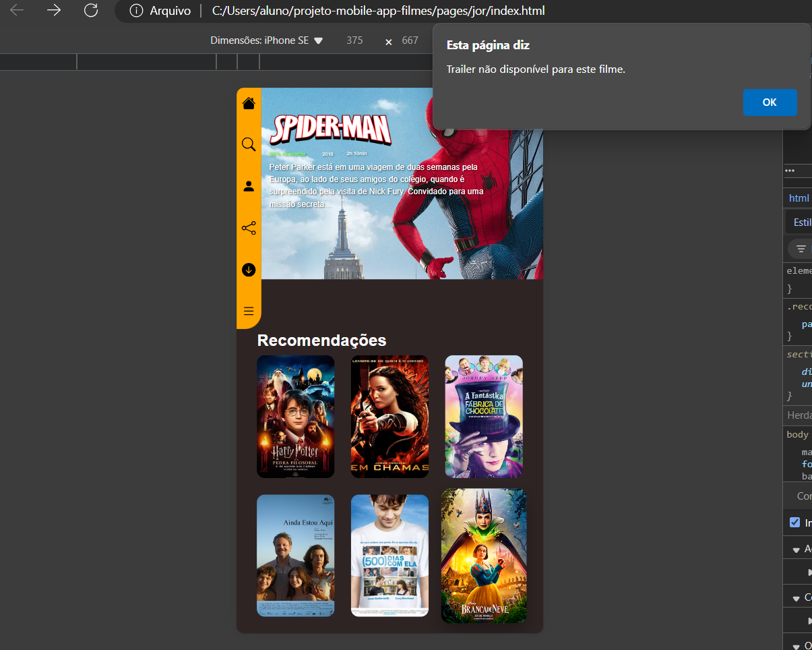

A API não funcionou nos filmes "ainda estou aqui" e "branca de neve" o link não foi encontrado então é exibido uma mensagem na tela dizendo que o trailer não está disponível.
A página em si é isso e você pode ser direcionado para outras páginas clicando em qualquer um dos ícones da navebar.

# página michel

Não terminou.

# sanduíche 

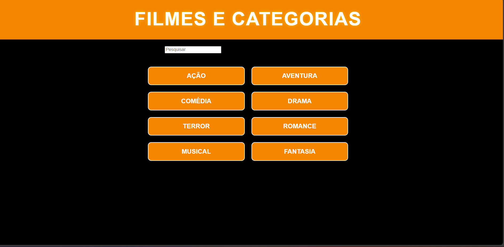

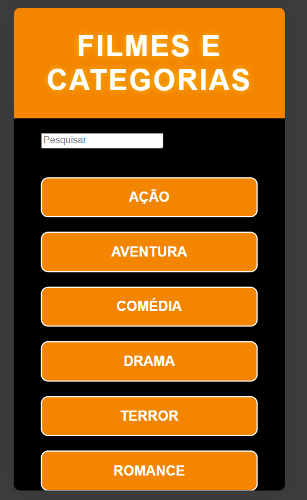

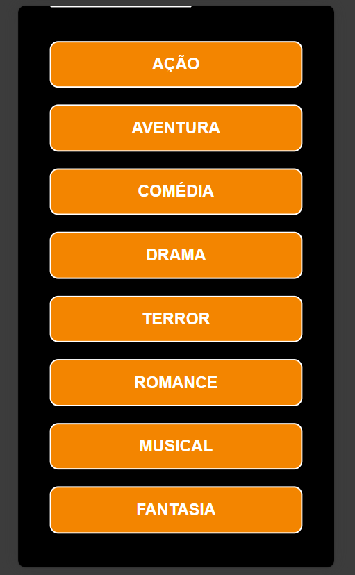

As imagens mostram o sanduíche, que é uma página que conta com os gêneros de filmes onde tem um efeito de zoom ao clicar em um gênero, como "terror" por exemplo. A página conta com uma barra de pesquisa onde funciona pra você digitar.

# pag yasmin

